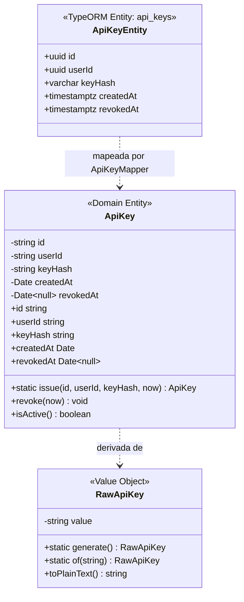
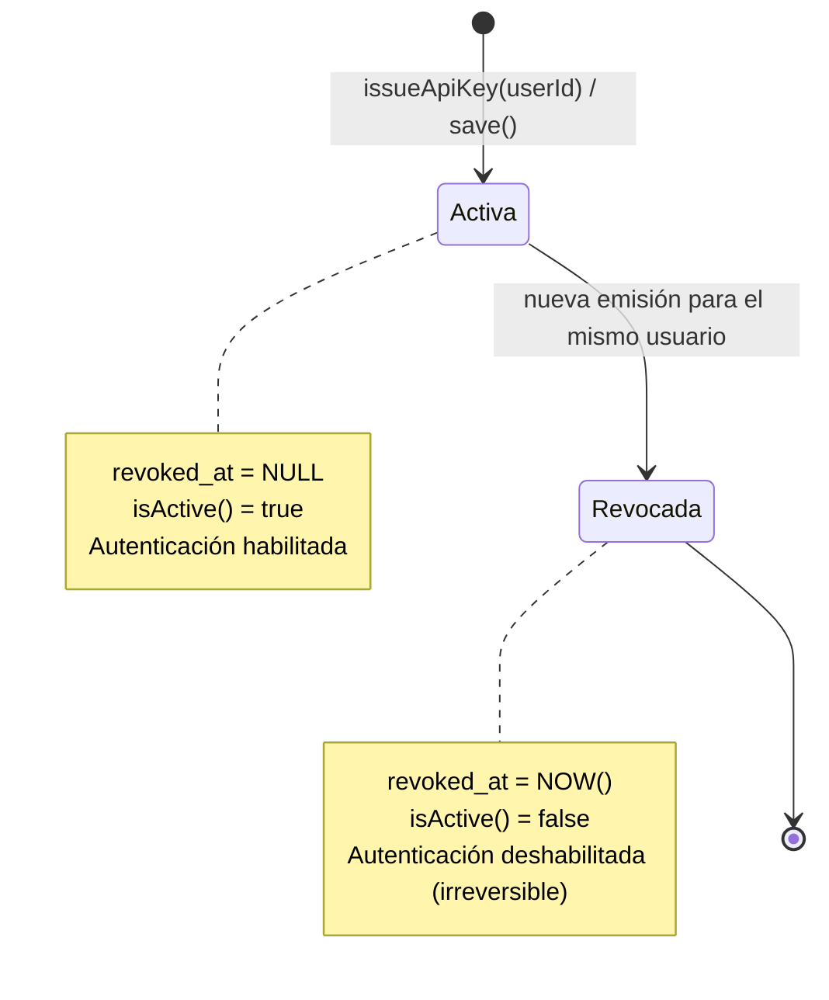

# Data Model: Emisión de ApiKey

**Feature**: `002-api-key-issuance`
**Date**: 2026-09-11
**Status**: Completed

Este documento describe el modelo de datos, entidades de dominio, entidades de persistencia, invariantes y transiciones de estado para la feature de emisión de ApiKey.

---

## 1. Diagrama de Dominio y Persistencia

---

## 2. Entidades de Dominio

### Value Object: `RawApiKey`
Representa la clave en texto plano antes de ser persistida. Solo vive temporalmente en memoria durante la emisión.

* **Atributos**:
  * `value`: `string` (privado). Cadena de 68 caracteres con formato exacto `pmk_[0-9a-f]{64}`.
* **Invariantes**:
  * No puede ser nula ni vacía.
  * Debe comenzar obligatoriamente con el prefijo `pmk_`.
  * Debe contener exactamente 64 dígitos hexadecimales en minúsculas luego del prefijo.
* **Métodos**:
  * `static generate(): RawApiKey`: Genera 32 bytes criptográficamente seguros con `crypto.randomBytes(32)` y concatena el prefijo `pmk_`.
  * `static of(value: string): RawApiKey`: Valida el formato y construye la instancia (lanza `InvalidApiKeyFormatError` si no cumple).
  * `toPlainText(): string`: Devuelve el valor textual para ser retornado al cliente en el DTO de respuesta.

### Entidad de Dominio: `ApiKey`
Representa el ciclo de vida y la identidad de la credencial persistida. Totalmente agnóstica de TypeORM y HTTP.

* **Atributos**:
  * `id`: `string` (UUID v4). Identificador unívoco de la credencial.
  * `userId`: `string` (UUID v4). Identificador del usuario propietario.
  * `keyHash`: `string` (64 caracteres hex). Hash SHA-256 de la clave en texto plano.
  * `createdAt`: `Date`. Momento exacto de emisión.
  * `revokedAt`: `Date | null`. Fecha de revocación; `null` si la clave está activa.
* **Invariantes y Reglas de Negocio**:
  * `keyHash` no puede estar vacío y debe tener exactamente 64 caracteres hexadecimales (representación SHA-256).
  * `userId` debe ser un identificador de usuario válido.
  * Una clave recién emitida tiene `revokedAt = null` y `isActive() === true`.
  * El método `revoke(at: Date)` establece `revokedAt = at`. No se puede revocar una clave ya revocada (lanza `ApiKeyAlreadyRevokedError`).
* **Métodos**:
  * `static issue(id: string, userId: string, keyHash: string, createdAt: Date): ApiKey`
  * `revoke(revokedAt: Date): void`
  * `isActive(): boolean`: Retorna `this.revokedAt === null`.

---

## 3. Modelo Físico / Persistencia (TypeORM)

### Tabla: `api_keys`

| Columna | Tipo | Nulo | Default | Restricciones / Índices | Descripción |
|---------|------|------|---------|-------------------------|-------------|
| `id` | `uuid` | No | `uuid_generate_v4()` | PRIMARY KEY | Identificador único de la ApiKey |
| `user_id` | `uuid` | No | - | INDEX, FK -> `users(id)` ON DELETE CASCADE | Usuario al que pertenece la clave |
| `key_hash` | `varchar(64)` | No | - | UNIQUE INDEX | Hash SHA-256 de la clave |
| `created_at` | `timestamptz` | No | `now()` | - | Fecha y hora de emisión |
| `revoked_at` | `timestamptz` | Sí | `NULL` | - | Fecha y hora de invalidación |

### Índices de Base de Datos
1. `PK_api_keys`: `PRIMARY KEY (id)`
2. `UQ_api_keys_hash`: `UNIQUE INDEX (key_hash)` — Garantiza que nunca existan dos claves idénticas.
3. `IDX_api_keys_active_user`: `CREATE UNIQUE INDEX idx_api_keys_active_user ON api_keys (user_id) WHERE revoked_at IS NULL;`
   * **Garantía Crítica**: Asegura a nivel de base de datos relacional que un usuario solo pueda tener **exactamente una ApiKey activa** (`revoked_at IS NULL`) a la vez.

---

## 4. Transiciones de Estado y Ciclo de Vida

### Flujo de Emisión Atómica:
1. El usuario autenticado llama a `POST /auth/api-key`.
2. El `ApiKeyService`:
   a. Consulta si existe una ApiKey activa para el `userId` (`findActiveByUserId(userId)`).
   b. Si existe, ejecuta `activeKey.revoke(now)` en dominio.
   c. Genera una nueva `RawApiKey` aleatoria.
   d. Calcula `keyHash = tokenHasher.hash(rawKey.toPlainText())`.
   e. Crea la nueva entidad `ApiKey.issue(uuid(), userId, keyHash, now)`.
   f. Dentro de una transacción de base de datos: persiste la revocación de la anterior (si existía) e inserta la nueva clave.
   g. Retorna al Controller un objeto con la nueva `ApiKey` de dominio y el `RawApiKey` en texto plano para construir la respuesta HTTP.

