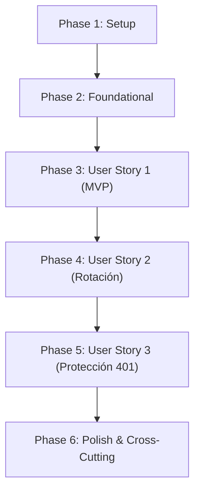

# Tasks: Emisión de ApiKey para usuario autenticado

**Input**: Design documents from `specs/002-api-key-issuance/`
**Prerequisites**: [plan.md](./plan.md), [spec.md](./spec.md), [research.md](./research.md), [data-model.md](./data-model.md), [contracts/](./contracts/), [quickstart.md](./quickstart.md)
**Tests**: INCLUIDOS. La constitución (Principio IX) exige tests unitarios de dominio (sin Nest/DB), integración con Testcontainers (PostgreSQL efímero), e2e con supertest, y tests automáticos de arquitectura con `tsarch`. Los tests de cada historia se escriben antes de su implementación y deben fallar primero.
**Organization**: Tareas agrupadas por historia de usuario en orden de prioridad (US1 [P1] → US2 [P1] → US3 [P2]). Cada historia es un incremento testeable de forma independiente.

## Format: `[ID] [P?] [Story?] Description with file path`

- **[P]**: Puede ejecutarse en paralelo (archivos independientes sin dependencias cruzadas pendientes).
- **[Story]**: `[US1]`, `[US2]`, `[US3]` (asignado exclusivamente en fases de historias de usuario).
- Rutas relativas a la raíz del repositorio (`backend/src/...`).

---

## Phase 1: Setup (Shared Infrastructure & Constants)

**Purpose**: Definir constantes de inyección, errores base de dominio y registro en el filtro de excepciones global.

- [X] T001 Crear constantes e identificadores de inyección en `backend/src/modules/api-key/api-key.constants.ts`: tokens `API_KEY_REPOSITORY = Symbol('API_KEY_REPOSITORY')`, `TOKEN_HASHER = Symbol('TOKEN_HASHER')`, constante `API_KEY_PREFIX = 'pmk_'`, longitud de entropía `API_KEY_RANDOM_BYTES = 32`.
- [X] T002 [P] Crear error de dominio `InvalidApiKeyFormatError` en `backend/src/modules/api-key/domain/errors/invalid-api-key-format.error.ts` (extiende `DomainError`, mensaje en español indicando que la clave debe iniciar con prefijo `pmk_` seguido de 64 caracteres hexadecimales).
- [X] T003 [P] Crear error de dominio `ApiKeyAlreadyRevokedError` en `backend/src/modules/api-key/domain/errors/api-key-already-revoked.error.ts` (extiende `DomainError`, mensaje en español indicando que la clave ya se encuentra revocada).
- [X] T004 Mapear errores de dominio en `backend/src/shared/filters/all-exceptions.filter.ts`: `InvalidApiKeyFormatError` → 400 Bad Request, `ApiKeyAlreadyRevokedError` → 409 Conflict.

**Checkpoint**: Errores y constantes base listos y reconocidos por el filtro global de excepciones.

---

## Phase 2: Foundational (Core Domain, Ports, Adapters, Persistence)

**Purpose**: Puertos de interfaz, adaptador SHA-256 desacoplado, entidad de persistencia TypeORM, repositorio y módulo base. **Bloquea la implementación de las historias de usuario.**

- [ ] T005 [P] Crear puerto de dominio `TokenHasher` en `backend/src/modules/api-key/adapters/token-hasher.ts`: interface con firmas `hash(token: string): string` y `compare(token: string, hash: string): boolean`.
- [ ] T006 [P] Unit test de `Sha256TokenHasher` en `backend/src/modules/api-key/adapters/sha256-token-hasher.spec.ts`: verifica generación determinística de hash SHA-256 en 64 caracteres hexadecimales y comparación segura contra timing attacks vía `compare`.
- [ ] T007 Implementar adaptador `Sha256TokenHasher` en `backend/src/modules/api-key/adapters/sha256-token-hasher.ts`: implementa `TokenHasher` utilizando `node:crypto` (`createHash('sha256')` y `timingSafeEqual`).
- [ ] T008 [P] Crear entidad TypeORM `ApiKeyEntity` en `backend/src/modules/api-key/repository/entities/api-key.entity.ts`: tabla `api_keys`, columnas `id` (uuid PK), `userId` (uuid NOT NULL, `name: 'user_id'`), `keyHash` (varchar(64) UNIQUE NOT NULL, `name: 'key_hash'`), `createdAt` (timestamptz default now, `name: 'created_at'`), `revokedAt` (timestamptz nullable, `name: 'revoked_at'`); índice parcial `idx_api_keys_active_user` sobre `user_id` donde `revoked_at IS NULL`.
- [ ] T009 [P] Crear puerto de repositorio `ApiKeyRepository` en `backend/src/modules/api-key/repository/api-key.repository.ts`: interface con firmas `findActiveByUserId(userId: string): Promise<ApiKey | null>`, `findByHash(keyHash: string): Promise<ApiKey | null>`, `save(apiKey: ApiKey): Promise<void>`, `saveWithRevocation(newKey: ApiKey, previousKey?: ApiKey): Promise<void>`.
- [ ] T010 Mapper de persistencia `ApiKeyMapper` en `backend/src/modules/api-key/repository/mappers/api-key.mapper.ts`: conversión bidireccional `toDomain(entity: ApiKeyEntity): ApiKey` y `toEntity(apiKey: ApiKey): ApiKeyEntity` sin lógica de negocio.
- [ ] T011 Implementar repositorio TypeORM `TypeOrmApiKeyRepository` en `backend/src/modules/api-key/repository/typeorm-api-key.repository.ts`: implementa `ApiKeyRepository` utilizando `Repository<ApiKeyEntity>` y `DataSource` para transacciones atómicas.
- [ ] T012 Crear `ApiKeyModule` en `backend/src/modules/api-key/api-key.module.ts` configurando `TypeOrmModule.forFeature([ApiKeyEntity])`, providers para `API_KEY_REPOSITORY` y `TOKEN_HASHER`, e importarlo en `backend/src/app.module.ts`.

**Checkpoint**: Infraestructura base de persistencia y puertos lista; módulo cableado en `AppModule`.

---

## Phase 3: User Story 1 — Emisión inicial de ApiKey para usuario autenticado (Priority: P1) 🎯 MVP

**Goal**: Permitir que un usuario con sesión iniciada (JWT válido) genere su primera ApiKey mediante `POST /auth/api-key`. El sistema genera 32 bytes de entropía con prefijo `pmk_`, guarda solo el hash SHA-256 en la tabla `api_keys`, y devuelve la clave en texto plano en la respuesta 201 por única vez.

**Independent Test**: Registrar usuario -> Iniciar sesión para obtener JWT -> Invocación `POST /auth/api-key` con header `Authorization: Bearer <jwt>` -> Retorna 201 con `{ id, apiKey: /^pmk_[0-9a-f]{64}$/, createdAt }`; verificar en base de datos PostgreSQL que en `api_keys` se almacena el hash de 64 caracteres y `revoked_at` es `NULL`.

### Tests for User Story 1 ⚠️ (escribir primero, deben fallar)

- [ ] T013 [P] [US1] Unit test del value object `RawApiKey` en `backend/src/modules/api-key/domain/raw-api-key.spec.ts`: valida generación aleatoria de 32 bytes (`crypto.randomBytes`), prefijo `pmk_`, longitud exacta de 68 caracteres, y validación regex `^pmk_[0-9a-f]{64}$`.
- [ ] T014 [P] [US1] Unit test de la entidad de dominio `ApiKey` en `backend/src/modules/api-key/domain/api-key.spec.ts`: `ApiKey.issue` inicializa estado activo (`isActive() === true`, `revokedAt === null`), getters inmutables, no expone secretos.
- [ ] T015 [P] [US1] Unit test de `ApiKeyService.issueApiKey` en `backend/src/modules/api-key/service/api-key.service.spec.ts`: emite clave cuando no hay previa, invoca `TokenHasher.hash` y `ApiKeyRepository.save`, retorna la entidad `ApiKey` y el `RawApiKey` en texto plano.
- [ ] T016 [P] [US1] Integration test de emisión inicial contra PostgreSQL con Testcontainers en `backend/src/modules/api-key/service/api-key.service.integration.spec.ts`: valida que se persiste el hash en la base real, `revoked_at` es nulo, y el texto plano jamás se escribe en disco.
- [ ] T017 [P] [US1] e2e test de emisión inicial en `backend/src/tests/api-key/api-key.e2e-spec.ts`: flujo completo `POST /auth/register` -> `POST /auth/login` -> `POST /auth/api-key` retornando 201 Created con cuerpo según contrato [contracts/api-key-api.md](./contracts/api-key-api.md).

### Implementation for User Story 1

- [ ] T018 [P] [US1] Crear value object `RawApiKey` en `backend/src/modules/api-key/domain/raw-api-key.ts`: factory method `RawApiKey.generate()` generando 32 bytes aleatorios hex con prefijo `pmk_`, factory `RawApiKey.of(value)` con validación de regex `^pmk_[0-9a-f]{64}$`, método `toPlainText(): string`.
- [ ] T019 [US1] Crear entidad de dominio `ApiKey` en `backend/src/modules/api-key/domain/api-key.ts`: atributos privados `_id`, `_userId`, `_keyHash`, `_createdAt`, `_revokedAt`; factory `ApiKey.issue(id, userId, keyHash, createdAt)`; getters de solo lectura y método `isActive(): boolean`.
- [ ] T020 [P] [US1] Crear DTO de respuesta `IssueApiKeyResponseDto` en `backend/src/modules/api-key/controller/dto/issue-api-key-response.dto.ts`: propiedades `id: string`, `apiKey: string`, `createdAt: Date`; decoradores `@ApiProperty` con descripción y ejemplos OpenAPI.
- [ ] T021 [US1] Implementar método `issueApiKey(userId: string)` en `backend/src/modules/api-key/service/api-key.service.ts`: genera `RawApiKey`, calcula hash con `TokenHasher`, instancia `ApiKey.issue`, persiste en repositorio y retorna `{ apiKey, rawApiKey }`.
- [ ] T022 [US1] Crear controlador `ApiKeyController` en `backend/src/modules/api-key/controller/api-key.controller.ts`: ruta `@Controller('auth/api-key')`, endpoint `@Post()`, inyecta `@CurrentUser() userId: string`, delega a `ApiKeyService.issueApiKey`, mapea a `IssueApiKeyResponseDto` y devuelve código HTTP 201; decoradores `@ApiTags('auth')`, `@ApiBearerAuth()`, `@ApiResponse`.
- [ ] T023 [US1] Registrar `ApiKeyController` y `ApiKeyService` como controllers y providers en `backend/src/modules/api-key/api-key.module.ts`.
- [ ] T024 [US1] Verificar que los tests T013 a T017 pasen en verde con `pnpm test:unit` y `pnpm test:integration`.

**Checkpoint**: User Story 1 completa y demostrable de forma independiente (MVP listo). Un usuario puede generar su primera ApiKey.

---

## Phase 4: User Story 2 — Rotación y reemplazo de ApiKey existente (Priority: P1)

**Goal**: Cuando un usuario que ya cuenta con una ApiKey activa solicita una nueva, el sistema invalida de inmediato la anterior (establece `revoked_at = now()`) y emite la nueva dentro de una transacción atómica, garantizando que el usuario tenga exactamente una clave activa a la vez.

**Independent Test**: Emitir ApiKey 1 para un usuario; solicitar inmediatamente una segunda ApiKey para el mismo usuario; verificar que la segunda llamada retorna 201 con nueva clave; consultar en PostgreSQL que la fila de la ApiKey 1 tiene `revoked_at` con timestamp válido y la ApiKey 2 tiene `revoked_at IS NULL`.

### Tests for User Story 2 ⚠️ (escribir primero, deben fallar)

- [ ] T025 [P] [US2] Unit test de revocación en `backend/src/modules/api-key/domain/api-key.spec.ts`: método `revoke(revokedAt: Date)` actualiza `revokedAt`, cambia `isActive()` a `false`; revocar una clave ya revocada lanza `ApiKeyAlreadyRevokedError`.
- [ ] T026 [P] [US2] Unit test de rotación en `backend/src/modules/api-key/service/api-key.service.spec.ts`: cuando `findActiveByUserId` retorna una clave existente, invoca `previousKey.revoke()` y ejecuta `saveWithRevocation` pasando ambas entidades.
- [ ] T027 [P] [US2] Integration test de rotación atómica contra PostgreSQL con Testcontainers en `backend/src/modules/api-key/service/api-key.service.integration.spec.ts`: emite clave 1 y luego clave 2 para el mismo usuario; verifica estado final en base de datos; valida que el índice parcial único rechace duplicados activos ante carreras concurrentes.
- [ ] T028 [P] [US2] e2e test de rotación en `backend/src/tests/api-key/api-key.e2e-spec.ts`: invocar `POST /auth/api-key` dos veces consecutivas con el mismo JWT; verificar que ambas respuestas son exitosas con identificadores y claves distintas, y que la primera queda invalidada en base de datos.

### Implementation for User Story 2

- [ ] T029 [US2] Implementar método `revoke(revokedAt: Date): void` en la entidad de dominio `ApiKey` en `backend/src/modules/api-key/domain/api-key.ts`, verificando que `this._revokedAt === null` antes de asignar.
- [ ] T030 [US2] Implementar método `saveWithRevocation(newKey: ApiKey, previousKey?: ApiKey): Promise<void>` en `backend/src/modules/api-key/repository/typeorm-api-key.repository.ts` ejecutando ambas operaciones (`save(previousEntity)` y `save(newEntity)`) dentro de una transacción `dataSource.transaction`.
- [ ] T031 [US2] Actualizar `ApiKeyService.issueApiKey` en `backend/src/modules/api-key/service/api-key.service.ts`: consultar `findActiveByUserId(userId)`; si existe, ejecutar `previousKey.revoke(new Date())`; persistir con `saveWithRevocation(newKey, previousKey)`.
- [ ] T032 [US2] Verificar que los tests T025 a T028 pasen en verde con `pnpm test:unit` y `pnpm test:integration`.

**Checkpoint**: User Story 1 y User Story 2 completas e integradas. La rotación atómica preserva la regla de exactamente 1 ApiKey activa por usuario.

---

## Phase 5: User Story 3 — Protección del endpoint ante accesos no autenticados (Priority: P2)

**Goal**: Asegurar que toda petición al endpoint `POST /auth/api-key` sin JWT, con token malformado o expirado sea rechazada inmediatamente con 401 Unauthorized sin generar registros en el sistema.

**Independent Test**: Invocar `POST /auth/api-key` sin header `Authorization` → 401 Unauthorized; con `Authorization: Bearer invalido` → 401; con JWT expirado → 401; en todos los casos la tabla `api_keys` permanece inalterada.

### Tests for User Story 3 ⚠️ (escribir primero, deben fallar)

- [ ] T033 [P] [US3] e2e tests de protección en `backend/src/tests/api-key/api-key.e2e-spec.ts`: verificar rechazo con código 401 ante petición sin header `Authorization`, con firma JWT inválida, y con token vencido, corroborando que no se inserta ninguna fila en `api_keys`.

### Implementation for User Story 3

- [ ] T034 [US3] Confirmar que `ApiKeyController` en `backend/src/modules/api-key/controller/api-key.controller.ts` no contenga el decorador `@Public()`, asegurando que `JwtAuthGuard` intercepte la solicitud.
- [ ] T035 [US3] Declarar decorador `@ApiResponse({ status: 401, description: 'No autenticado.' })` en el endpoint de `ApiKeyController`.
- [ ] T036 [US3] Verificar que el test T033 pase en verde con `pnpm test:e2e`.

**Checkpoint**: Las tres historias de usuario están completamente implementadas y protegidas por autenticación.

---

## Phase 6: Polish & Cross-Cutting Concerns

**Purpose**: Verificación de reglas de arquitectura con `tsarch`, documentación de Swagger/Postman y validación de calidad integral.

- [ ] T037 [P] Agregar tests de arquitectura para `modules/api-key` en `backend/test/architecture/layers.spec.ts` usando `tsarch`:
  - `ApiKeyController` no depende de `repository` ni de `adapters`.
  - `ApiKeyService` no depende de `entities` ni de `mappers` de persistencia.
  - `ApiKeyService` no importa `node:crypto` directamente (debe usar `TokenHasher`).
  - El dominio `modules/api-key/domain` no depende de `@nestjs` ni de `typeorm`.
- [ ] T038 [P] Actualizar la colección de Postman en `docs/postman/desapp.postman_collection.json` agregando la request `POST /auth/api-key` con el header `Authorization: Bearer {{accessToken}}` y tests de verificación de esquema JSON.
- [ ] T039 Ejecutar suite completa de calidad en `backend/`: `pnpm lint`, `pnpm test:unit`, `pnpm test:integration`, `pnpm test:e2e` y `pnpm build`.
- [ ] T040 Ejecutar y validar los escenarios manuales con `curl` descriptos en [quickstart.md](./quickstart.md).

---

## Dependencies & Execution Order

### Phase Dependencies

- **Phase 1 (Setup)**: Sin dependencias, inicia inmediatamente.
- **Phase 2 (Foundational)**: Requiere Phase 1. Bloquea todas las historias de usuario.
- **Phase 3 (User Story 1 - MVP)**: Requiere Phase 2. Entrega el flujo central de emisión.
- **Phase 4 (User Story 2)**: Requiere Phase 3 (reutiliza entidades y servicio para agregar revocación atómica).
- **Phase 5 (User Story 3)**: Requiere Phase 3/4 (valida el comportamiento del guard sobre el endpoint existente).
- **Phase 6 (Polish)**: Requiere la finalización de todas las historias de usuario.

### Parallel Opportunities

- **Phase 1**: T002 y T003 pueden ejecutarse en paralelo.
- **Phase 2**: T005, T006, T008 y T009 son paralelizables entre sí.
- **Phase 3 (Tests)**: T013, T014, T015, T016 y T017 pueden redactarse en paralelo antes de la implementación.
- **Phase 3 (Impl)**: T018 y T020 pueden crearse en paralelo.
- **Phase 4 (Tests)**: T025, T026, T027 y T028 son paralelizables.
- **Phase 6**: T037 y T038 pueden ejecutarse en paralelo.

---

## Implementation Strategy

### MVP First (User Story 1 Only)
1. Completar Phase 1 (Setup) y Phase 2 (Foundational).
2. Completar Phase 3 (User Story 1).
3. **Validación de Checkpoint MVP**: Ejecutar `pnpm test:unit` y `pnpm test:integration` sobre emisión inicial.
4. En este punto se dispone de un incremento funcional y demostrable que emite ApiKeys seguras sin exponer texto plano en base de datos.

### Entrega Incremental
1. **Incremento 1**: Emisión inicial de ApiKey (`/auth/api-key`) con hash SHA-256 (US1).
2. **Incremento 2**: Invalidación y rotación atómica de claves previas (US2).
3. **Incremento 3**: Validación de rechazo ante solicitudes no autenticadas (US3).
4. **Incremento 4**: Validación de arquitectura `tsarch` y actualización de colección Postman (Polish).

