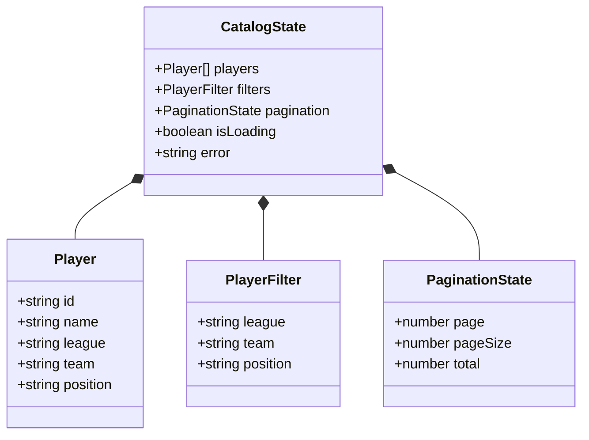

# Phase 1: Data Model — Frontend Catálogo de Jugadores

**Feature**: `005-frontend-player-catalog` | **Date**: 2026-09-20
**Spec**: [spec.md](./spec.md) | **Research**: [research.md](./research.md)

---

## Dominio y Entidades Cliente



---

## Definición de Interfaces (DTOs y Tipos Frontend)

### 1. `Player` (`src/types/catalog.types.ts`)

Representa la información de un futbolista en la interfaz.

```typescript
export type League = 'Premier League' | 'Bundesliga' | 'La Liga' | 'Serie A' | 'Ligue 1';
export type Position = 'GK' | 'DF' | 'MF' | 'FW';

export interface Player {
  id: string;
  name: string;
  league: League | string;
  team: string;
  position: Position | string;
}
```

### 2. `PlayerListResponseDto`

Respuesta paginada del backend al consultar `GET /players`.

```typescript
export interface PlayerListResponseDto {
  data: Player[];
  meta: {
    total: number;
    page: number;
    pageSize: number;
    totalPages: number;
  };
}
```

### 3. `CatalogFilters`

Estructura de filtros aplicados en la vista.

```typescript
export interface CatalogFilters {
  league?: string;
  team?: string;
  position?: string;
}
```

---

## Constantes de Dominio

```typescript
export font-const LEAGUES: League[] = [
  'Premier League',
  'Bundesliga',
  'La Liga',
  'Serie A',
  'Ligue 1',
];

export font-const POSITIONS: Position[] = ['GK', 'DF', 'MF', 'FW'];
```

---

## Almacenamiento Local (`src/service/apiKeyStorage.ts`)

- **Clave localStorage**: `api_key`
- **Métodos**:
  - `getApiKey(): string | null`
  - `setApiKey(key: string): void`
  - `clearApiKey(): void`

